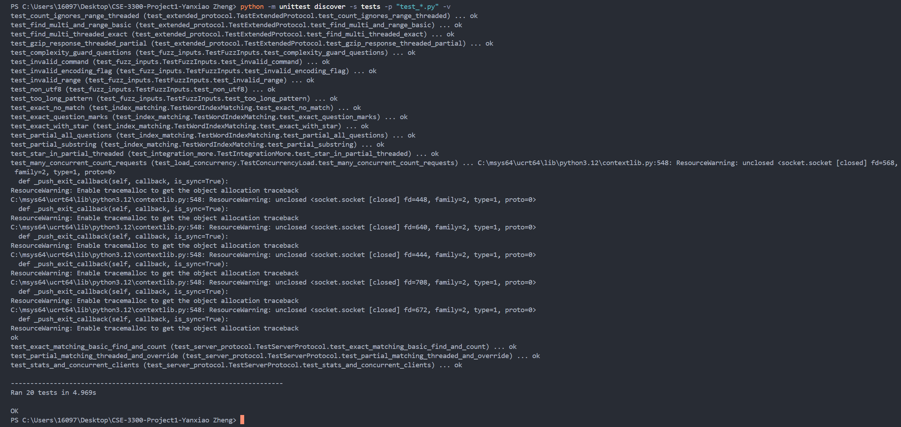

# SUBMISSION.md — Project 1: Text Search TCP Service

**Course:** CSE 3300
**Student:** Yanxiao Zheng  
**Date:** 2025-10-25  
**OS / Python:** Windows 10/11 (PowerShell), Python 3.12  
**Repo root:** `CSE-3300-Project1-Yanxiao Zheng/`

---

## 0) What I am submitting

- Source code: `server_basic.py`, `client_basic.py`, `server_threaded.py`, `client_multi.py`, `index.py`, `benchmark.py`, `wordlist.txt`.
- Design doc: `PROTOCOL_AND_DESIGN.md`.
- README with quick start commands.
- Screenshots for the required 4 cases (client + server). See Section 4.
- Course tag (CSE3300 or CSE5299) is shown at the top of this file.

---

## 1) What the project does (very short)

- A simple word search service over TCP with a line-based text protocol.
- Two servers: **basic** (single-thread) and **threaded** (multi-thread).
- Two clients: **basic** (one query) and **multi** (interactive).
- Supports single-char wildcard **`?`**.
- Optional paging: `--range start end` (for large outputs).
- Optional gzip response: `--gzip`.

---

## 2) How to run (TA can copy/paste)

> Use `python` (on some systems `python3`).

### Basic server + one-shot client

```powershell
python server_basic.py   --host 127.0.0.1 --port 8080 --wordlist wordlist.txt
python client_basic.py   --host 127.0.0.1 --port 8080 --query "a?t"
```

Proof screenshot (both sides):


### Threaded server + interactive client

```powershell
python server_threaded.py --host 127.0.0.1 --port 8081 --wordlist wordlist.txt --mode partial
python client_multi.py    --host 127.0.0.1 --port 8081
```

Tips: If the output is huge, add `--range 0 50` or `--gzip` on the client.

---

## 3) Protocol (short summary)

- **Requests (one line):**
  - `FIND <pattern> [--range <start> <end>] [--gzip] [--mode exact | partial]`
  - `COUNT <pattern> [--mode exact | partial]`
- **Response:**
  - Success: status line is `<code> <text> <count>` (e.g., `200 OK 42`, `404 NOT-FOUND 0`)
  - Then zero or more result lines (for `FIND`)
  - Errors: `400 BAD-REQUEST <reason>` or `500 SERVER-ERROR <reason>` (no count)
  - Always ends with a line `END`
- Common codes: `200` success, `404` no match, `400` bad request, `500` server error.
- `?` means exactly one character. All other characters are literal.

**Compatibility note:** Protocol extensions (e.g., `STATS`, `BATCH`, `--gzip`, `RANGE`) are optional and fully backward compatible. The baseline protocol for grading (plain `FIND`/`COUNT` with status line + count and `END`) remains unchanged; graders not using extensions are unaffected.

Full details are in `PROTOCOL_AND_DESIGN.md`.

---

## 4) Required 4 cases (with screenshots)

All run on **threaded server** with `--mode partial`. Client shows **status line + results + END + total**.

### Case 1 — Ten question marks

Input: ``??????????``  
Observed total: **24071**  
Screens (client + server in one capture):  


### Case 2 — Single question mark

Input: ``?``  
Observed total: **69903**  


### Case 3 — Question mark + `(a)`

Input: ``?(a)``  
Observed total: **414**  


### Case 4 — Dash, question mark, dash

Input: ``-?-``  
Observed total: **13**  


---

## 5) Testing

### 5.1 Run all tests (one command)

Use either of the following (both work).

#### Windows PowerShell (recommended)

```powershell
python -m unittest discover -s tests -p "test_*.py" -v
```

At the end you should see `OK` (or `OK (skipped=X)`). Example:



> Heads-up: On Windows you may see many `ResourceWarning: unclosed socket` lines during the heavy concurrency test.
> This is expected when many sockets open/close quickly and does **not** mean failure. The final `OK` is what matters.

#### What the tests cover

- Protocol rules (`200/400/404`, status line format, `END` line`).
- Matching logic (exact `a?t`, all-questions, substring/partial).
- Integration paths (threaded server, partial mode, range/gzip).
- Concurrency load (many clients at once).
- Fuzz/invalid inputs (bad commands, encoding, too-long patterns).

### 5.2 Manual spot checks

- Status line format is correct, and every response ends with `END`.
- Large results work with `--range` and/or `--gzip`.
- Bad inputs return `400` and do not crash the server.
- Optional: `COUNT` returns the same number as `FIND` for the same pattern.

### 5.3 Troubleshooting

- **Port already in use** → change `--port` or kill leftover Python processes.
- **Console slows on huge outputs** → add `--range 0 50` or `--gzip`.
- **Windows aborted connection** → use the updated client (shared `makefile()`), or use paging/gzip.

---

## 6) Performance (optional evidence)

Benchmark on threaded server (example):

```powershell
python benchmark.py --port 8081 --cmd "COUNT h?llo --mode exact" --concurrency 50 --duration 5
```

Example screenshot and numbers:


From the screenshot: **QPS ~ 1829.2**, p50 ≈ **26.1 ms**, p95 ≈ **33.2 ms**, p99 ≈ **37.46 ms**.

---

## 7) Notes / known issues

- On Windows, sometimes a connection can be aborted (WinError 10053). Using one shared `makefile()` reader in the client, or using `--range`/`--gzip`, makes it stable on my machine.

---

## 8) Academic honesty

This work is for my course study. If I referenced public code, I marked the source and my changes in the comments and docs.
